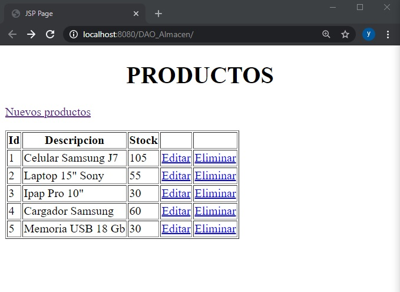
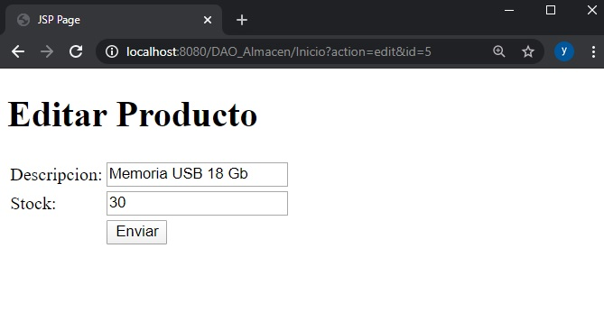
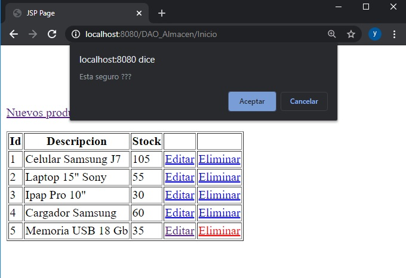
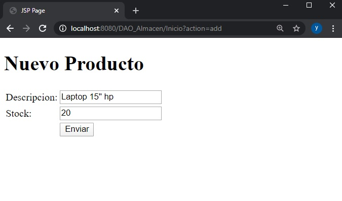

# PRACTICA-5
Es una aplicacion para gestionar los productos de un almacen.

$ mysqldump -h ip_servidor -u usuario_bd -p base_de_datos > bd_almacen.sql

[README](your-project-name/blob/master/your-subfolder/README.md)

wget https://raw.githubusercontent.com/wnpower/MigrateMySQL/master/exportMySQL.sh -O ./exportMySQL.sh && bash ./
